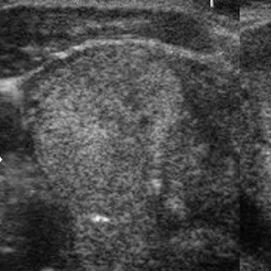
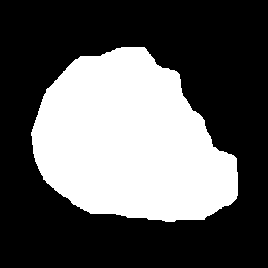

The post-processing of DDTI thyroid nodule untrasound dataset: https://www.kaggle.com/datasets/dasmehdixtr/ddti-thyroid-ultrasound-images, with the load_data.py class.

To use:
from load_data import DDTIDataset
dataset = DDTIDataset(image_dir, mask_dir, label_path, t, bi_label=True)

1. Split nodules when two nodules in an image.
2. Generate corresponding masks.
3. Remove black border.
4. Resize to square images.

139_1(2) stands for the first image and the second nodule of 139_1.xml

